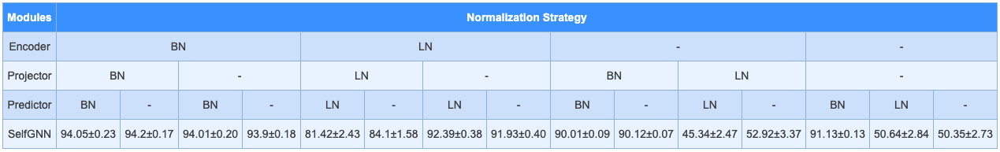

# SelfGNN

A PyTorch implementation of "SelfGNN: Self-supervised Graph Neural Networks without explicit negative sampling" [paper](https://arxiv.org/abs/2103.14958), which will appear in The International Workshop on Self-Supervised Learning for the Web (SSL'21) @ the Web Conference 2021 (WWW'21).

## Note
This is an ongoing work and the repository is subjected to continuous updates.


## Requirements!

-   Python 3.6+
-   PyTorch 1.6+
-   PyTorch Geometric 1.6+
-   Numpy 1.17.2+
-   Networkx 2.3+
-   SciPy 1.5.4+

## Example usage

```sh
$ python src/train.py
```

## :collision: Updates 

## update 2:

Contrary to what we've claimed in the paper, [studies](https://arxiv.org/abs/2010.10241) argue and empirically show that Batch Norm does not introduce implicit negative samples.
Instead, mainly it compensate for improper initialization. New experiments that we have carried out, as shown in the table below, seems to confirm this argument.



## update 1:

- Both the paper and the source code are updated following the discussion on [this issue](https://github.com/zekarias-tilahun/SelfGNN/issues/1)
- Ablation study on the impact of ```BatchNorm``` added following reviewers feedback from SSL'21
   - The findings show that ```SelfGNN``` with out batch normalization is not stable and often its performance drops significantly
   - Layer Normalization behaves similar to the finding of no ```BatchNorm```

   
## Possible options for training SelfGNN


The following options can be passed to `src/train.py`

`--root:` or `-r:`
A path to a root directory to put all the datasets. Default is `./data`

`--name:` or `-n:`
The name of the datasets. Default is `cora`. Check the [`Supported dataset names`](#Supported-dataset-names)

`--model:` or `-m:`
The type of GNN architecture to use. Curently three architectres are supported (gcn, gat, sage).
Default is gcn.

`--aug:` or `-a:`
The name of the data augmentation technique. Curently (ppr, heat, katz, split, zscore, ldp, paste) are supported.
Default is split.

`--layers:` or `-l:`
One or more integer values specifying the number of units for each GNN layer.
Default is 512 128

`--norms:` or `-nm:`
The normalization scheme for each module. Default is `batch`. That is, a Batch Norm will be used in the prediction head. 
Specifying two inputs, e.g. ```--norms batch layer```, allows the model to use batch norm in the GNN encoder, and layer 
norm in the prediction head. Finally, specifying three inputs, e.g., ```--norms no batch layer``` activates the 
projection head and normalization is used as: No norm for GNN encoder, Batch Norm for projection head and Layer Norm 
for the prediction head.

`--heads:` or `-hd:`
One or more values specifying the number of heads for each GAT layer.
Applicable for `--model gat`. Default is 8 1

`--lr:` or `-lr:`
Learning rate, a value in [0, 1]. Default is 0.0001

`--dropout:` or `-do:`
Dropout rate, a value in [0, 1]. Deafult is 0.2

`--epochs:` or `-e:`
The number of epochs. Default is 1000.

`--cache-step:` or `-cs:`
The step size for caching the model. That is, every `--cache-step` the model will be persisted. Default is 100.

`--init-parts:` or `-ip:`
The number of initial partitions, for using the improved version using Clustering.
Default is 1.

`--final-parts:` or `-fp:`
The number of final partitions, for using the improved version using Clustering.
Default is 1.

## Supported dataset names

| name        | Description | Edges   | Features | Classes | Description                   |
| ----------- | ----------- | ------- | -------- | ------- | ----------------------------- |
| `Cora`      | 2,708       | 5,278   | 1,433    | 7       | Citation Network              |
| `Citeseer`  | 3,327       | 4,552   | 3,703    | 6       | Citation Network              |
| `Pubmed`    | 19,717      | 44,324  | 500      | 3       | Citation Network              |
| `Photo`     | 7,487       | 119,043 | 745      | 8       | Co-purchased products network |
| `Computers` | 13,381      | 245,778 | 767      | 10      | Co-purchased products network |
| `CS`        | 18,333      | 81,894  | 6,805    | 15      | Collaboration network         |
| `Physics`   | 34,493      | 247,962 | 8,415    | 5       | Collaboration network         |


Any dataset from the PyTorch Geometric library can be used, however `SelfGNN` is tested only on
the above datasets.


Citing
------

If you find this research helpful, please cite it as

```
@misc{kefato2021selfsupervised,
      title={Self-supervised Graph Neural Networks without explicit negative sampling}, 
      author={Zekarias T. Kefato and Sarunas Girdzijauskas},
      year={2021},
      eprint={2103.14958},
      archivePrefix={arXiv},
      primaryClass={cs.LG}
}
```